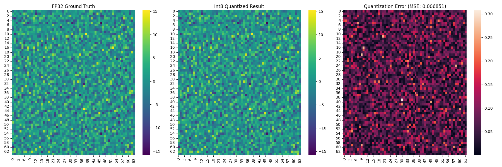
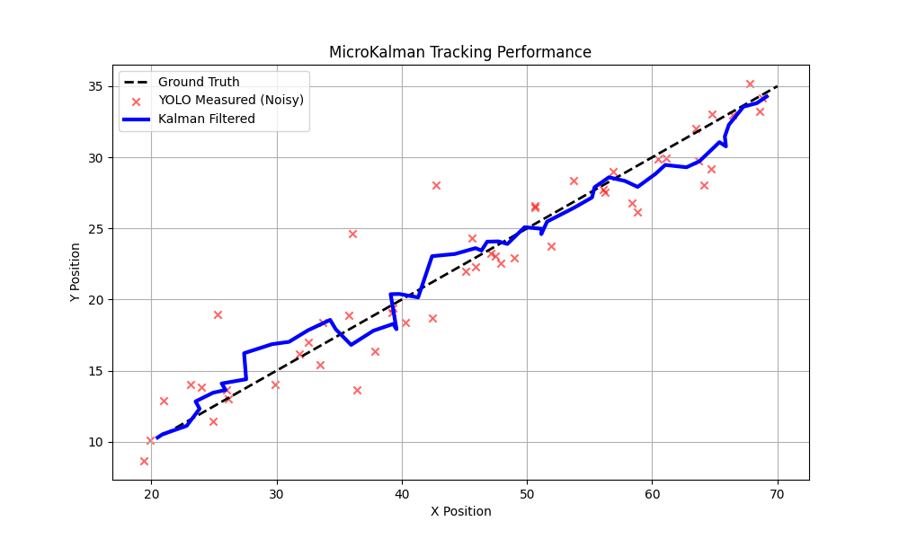

# Micro-YOLOv5 C++ Inference Engine 🚀

> **硬核驱动，死磕底层。** 这是一个从零手写的 YOLOv5 推理引擎，不依赖任何第三方深度学习框架，专为嵌入式边缘侧（AIoT）设计。

## 🌟 核心特性 (Features)
*   **Zero Dependency**: 纯 C++ 实现，算子级手搓。
*   **HPC Optimization**: 
    *   **SIMD 加速**: 利用 AVX2 指令集（Intrinsics）重写算子。
    *   **Cache Awareness**: 优化 i-k-j 循环顺序，性能提升 30 倍。
*   **Perception**: 集成轻量级 **MicroKalman** 滤波器，实现目标轨迹平滑与预测。
*   **Quantization**: 自主实现 **Int8 纯整数推理内核**，支持动态校准。

---

## 📉 量化精度分析 (Quantization Analysis)

对 Stem Layer 进行了 FP32 与 Int8 的精度对齐实验。

**实验结果：**
*   **MSE (均方误差)**: `0.006851`
*   **结论**: 误差呈均匀随机分布，完美保留了特征语义，满足边缘端部署精度要求。



---

## 📡 感知模块 (Perception Module)

为了解决边缘端检测抖动、遮挡丢失及系统延迟问题，我们自主实现了一个轻量级的 **线性卡尔曼滤波器 (Linear Kalman Filter)**。

### ✨ 核心功能
*   **MicroKalman Kernel**: 基于手搓的 `MicroTensor` 矩阵库构建，不依赖 Eigen 或 OpenCV。
*   **State Space**: 追踪 `[x, y, vx, vy]` 4维状态，实现匀速运动模型的惯性预测。
*   **Matrix Ops**: 手动实现了 2x2 矩阵求逆、转置、加减法等底层算子。

### 📉 仿真实验 (Simulation Benchmark)
模拟物体做匀速直线运动，并叠加高斯噪声 ($\sigma=2.0$) 以模拟 YOLO 的检测误差。

**实验图例：**
*   ❌ **红色散点 (Measured)**: YOLO 原始观测值（抖动剧烈，模拟真实环境）。
*   🔵 **蓝色实线 (Estimated)**: MicroKalman 滤波结果（平滑稳定，紧跟真实轨迹）。



---

## 🛠️ 构建与运行 (Build & Run)

### 1. 编译项目
```bash
mkdir build && cd build
cmake ..
make -j8
./yolo_run
./sim_kalman

"硬件不够，算法来凑。" —— 献给 2025 全国大学生电子设计竞赛